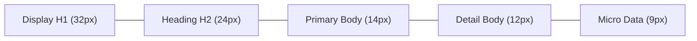
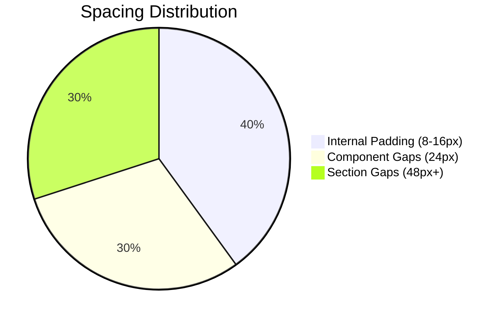

#  LapLab: UI Design Specification

> [!IMPORTANT]
> **LapLab** is a high-performance precision environment. All design decisions must prioritize **data legibility** and **sub-millisecond accuracy**.

---

## 1. Visual Theme & Atmosphere
The LapLab design system, **"Velocity Glass,"** is engineered for high-precision data analysis. It creates a focused, immersive environment through a deep dark foundation layered with translucent, blurred glass surfaces.

### Core Aesthetics
- **Foundation**: Deep charcoal backgrounds to minimize eye strain.
- **Elevation**: Depth is established through `backdrop-blur` (Glassmorphism).
- **Emphasis**: High-contrast accents (Emerald and Racing Red) guide the user.

---

## 2. Color Palette

| Role | Color | HEX | Usage |
| :--- | :--- | :--- | :--- |
| **Dark Base** |  | `#111113` | Main application background. |
| **Dark Surface** |  | `#1C1C21` | Secondary backgrounds for cards. |
| **Border** |  | `#33333A` | Defining geometry. |
| **Emerald Apex** |  | `#10B981` | Success and optimal performance. |
| **Racing Red** |  | `#EF4444` | Errors and critical limits. |
| **Challenger Blue** |  | `#3B82F6` | Primary rival telemetry. |

---

## 3. Typography

**Primary Font Family**: Inter (Geometric Sans-Serif)

| Role | Size | Weight | Line Height | Case |
| :--- | :--- | :--- | :--- | :--- |
| **Display H1** | 32px | 700 | 40px | Uppercase |
| **Heading H2** | 24px | 700 | 32px | Uppercase |
| **Card Title** | 18px | 700 | 24px | Uppercase |
| **Primary Body** | 14px | 400 | 20px | Normal |

---

## 4. Component Design Language

### Buttons
- **Primary**: High-contrast Off-White surface with Dark text.
- **Secondary**: Dark semi-transparent surface with light text.
- **Corner Radius**: `12px` (Standardized).

> [!TIP]
> Use **Glow Effects** (`box-shadow`) sparingly to highlight the active "Apex" state or critical failures.

---

## 5. Layout & Spacing

**Base Unit**: `4px`

### Responsive Strategy
- **Mobile**: Single column stack; 44px touch targets.
- **Desktop**: Full 12-column telemetry grid; 98% container width.
